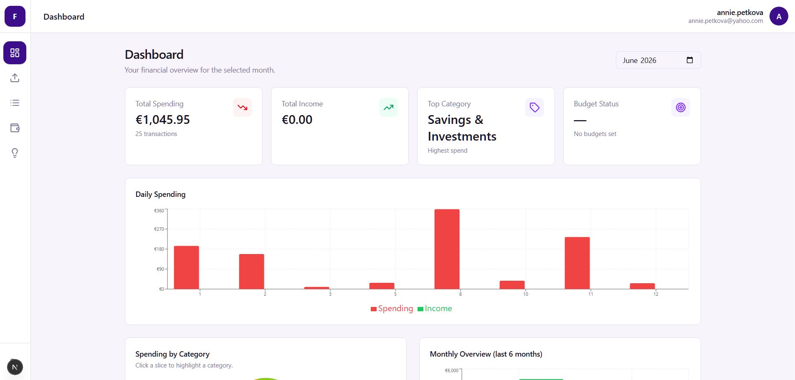
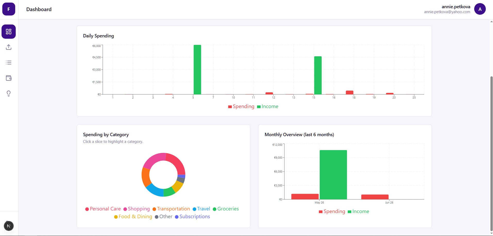

# FinanceAI

AI-powered personal finance assistant. Upload your bank statement PDF, get your transactions automatically extracted and categorized by Google Gemini, then explore your spending through charts, budgets, and AI-generated insights.

## Screenshots

| Dashboard overview | Spending charts |
| --- | --- |
|  |  |

## Features

- **PDF import** — drop a bank statement PDF; Gemini reads it directly and extracts every transaction regardless of format, language, or layout, categorizing in the same pass
- **Learned rules** — categorizations you confirm (or Gemini is confident about) are remembered per description and applied automatically on future uploads
- **AI categorization** — hybrid approach: instant regex rules for obvious merchants (Netflix, Spotify, Shell), Gemini for everything ambiguous
- **Human-in-the-loop editing** — override any AI category; manually-edited rows are protected from future AI overwrites
- **Dashboard** — daily spending chart, category breakdown pie, 6-month comparison bar chart, all updating per selected month
- **Budgets** — set monthly spending limits per category, track progress with color-coded bars
- **AI insights** — one-click financial analysis: overspending warnings, saving opportunities, spending trends

## Stack

- **Framework**: Next.js 16 (App Router) + React 19 + TypeScript strict
- **Database / Auth**: Supabase (PostgreSQL + Row Level Security)
- **AI**: Google Gemini API (`@google/genai`, `gemini-2.5-flash`, via Next.js Route Handlers — key never touches the client)
- **State**: TanStack Query for server state, React Context for auth
- **UI**: Tailwind CSS v4 + shadcn/ui primitives
- **Charts**: Recharts (lazy-loaded)
- **Validation**: Zod at all external boundaries (PDF parse output, AI API responses, user input)
- **Tests**: Vitest + React Testing Library (118 tests)

## Getting started

### Prerequisites

- Node.js 18+
- A [Supabase](https://supabase.com) project
- A [Google AI Studio](https://aistudio.google.com/apikey) Gemini API key

### 1. Install dependencies

```bash
npm install
```

### 2. Configure environment variables

Create `.env.local` in the project root:

```env
NEXT_PUBLIC_SUPABASE_URL=https://your-project.supabase.co
NEXT_PUBLIC_SUPABASE_ANON_KEY=your-supabase-anon-key
GEMINI_API_KEY=your-gemini-api-key
```

Get your Gemini API key at **aistudio.google.com/apikey**. All three AI routes (PDF parsing, categorization, insights) currently call the `gemini-2.5-flash` model directly — there's no env var to override it.

### 3. Set up the database

Run both migrations against your Supabase project. You can do this in the Supabase dashboard under **SQL Editor**:

```
supabase/migrations/00001_initial_schema.sql
supabase/migrations/00002_fix_profile_trigger.sql
```

This creates the `profiles`, `transactions`, `budgets`, `insights`, and `uploads` tables with Row Level Security enabled — each user can only ever see their own data.

### 4. Run the app

```bash
npm run dev
```

Open [http://localhost:3000](http://localhost:3000), sign up, and upload a bank statement PDF.

## Project structure

```
src/
  app/                  # Next.js App Router
    (auth)/             # Public pages (login, signup) — redirects away if logged in
    (app)/              # Protected pages (dashboard, upload, transactions, budget, insights)
    api/                # Route Handlers — all Gemini API calls live here (server-only)
  features/             # Feature components (upload, transactions, dashboard, budget, insights)
  lib/
    ai/                 # Gemini service layer: prompts, parsing, retry, rules-based categorizer
    parsers/            # Parsing utilities and shared types (e.g. ParseResult)
    supabase/           # Client singleton + typed query functions
    validators/         # Zod schemas for all external data
  hooks/                # Custom React hooks (useAuth, useTransactions, useBudgets, etc.)
  components/           # Shared UI components (ErrorBoundary, LoadingSpinner, etc.)
  context/              # Auth context (thin wrapper around Supabase onAuthStateChange)
  types/                # Domain models — source of truth, kept in sync with Supabase
```

## Development commands

```bash
npm run dev          # Start dev server (Turbopack)
npm run build        # Production build
npm test             # Run unit tests (Vitest)
npm run lint         # ESLint
npx tsc --noEmit     # Type check only
```

## Architecture notes

**AI calls are server-only.** The Gemini API key is never sent to the browser. All three routes (`/api/parse-csv`, `/api/categorize`, `/api/insights`) authenticate the caller via Supabase bearer token before touching the AI, despite the first route's name being a holdover from the earlier CSV-based flow.

**PDF parsing uses Gemini's native document understanding.** The PDF is read as base64 in the browser and sent to the route, which passes it to Gemini as `inlineData` with `application/pdf`. Extraction and categorization happen in a single call, and previously-confirmed "learned rules" for that user are injected into the prompt so recurring merchants are categorized consistently across uploads.

**Hybrid categorization keeps costs low.** A regex rule set handles well-known merchants instantly with zero API calls. Only genuinely ambiguous transactions go to Gemini, batched to minimize round trips.

**Optimistic UI on category edits.** Category changes update the UI immediately and sync to Supabase in the background, with automatic rollback on failure.

**AI failures are isolated.** The insights feature and the upload flow each have their own error boundary — a Gemini API error never crashes the dashboard or any other page.
